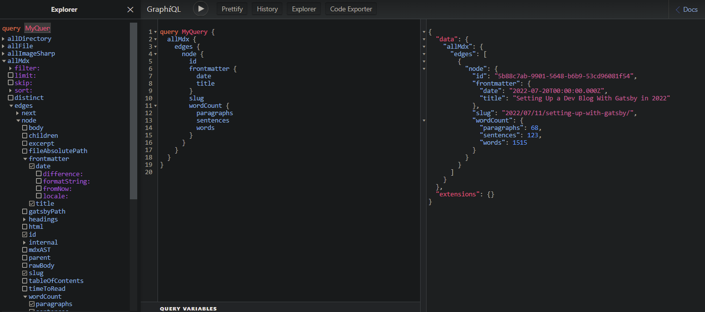

# Setting Up a Dev Blog with Gatsby in 2022

Today we will set up our new dev blog. We will build it with Gatsby. The initial goals are simple blog functionality, markdown files to store our content, and a few other things one would probably like given the need to work with a lot of code - like syntax highlighting. A copy to clipboard button would also be nice on the user side. Our aims are primarily experimental and educational. Seeing as we already have some idea what we want, let's make it happen.

Following along with this should produce more or less the page you're looking at, given the same mdx source file. The source file behind this page is [here](https://raw.githubusercontent.com/jonkers3/dev-blog/master/blog/2022/07/20/setting-up-with-gatsby/index.mdx).

### The Gatsby CLI

Use the CLI to bootstrap the project. We don't even need to install it as we can run it with NPX. While it is possible to install Gatsby and configure all of these plugins manually, I didn't really learn anything particularly useful by doing that, other than that the CLI installs some dependencies that aren't entirely obvious, so just use the CLI.

<br/>

## 1. Create a new Gatsby Project
---

```
$ npx gatsby new

What would you like to call your site?

✔ My Blog
```

Run the CLI and follow the prompts. We have options as far as plugins, typescript or not, and things of that sort. We elected for MDX support, responsive images, and React Helmet. We're going to be using plain CSS modules. This generated the following gatsby-config.ts file for us:

#### *`gatsby-config.ts`*
```javascript
import type { GatsbyConfig } from 'gatsby'

const config: GatsbyConfig = {
  siteMetadata: {
    title: `My New Dev Blog`,
    siteUrl: `...`
  },

  graphqlTypegen: true, // typescript only

  plugins: [
    'gatsby-plugin-image',
    'gatsby-plugin-react-helmet',
    'gatsby-plugin-mdx',
    'gatsby-plugin-sharp',
    'gatsby-transformer-sharp',

    {
      resolve: 'gatsby-source-filesystem',
      options: {
        name: 'images',
        path: './src/images/'
      },
      __key: 'images'
    },

    {
      resolve: 'gatsby-source-filesystem',
      options: {
        name: 'pages',
        path: './src/pages/'
      },
      __key: 'pages'
    },
  ]
}

export default config
```

Setup an alias for our components directory so we can use absolute imports:
#### *`gatsby-node.js`*
```js
const path = require('path')
exports.onCreateWebpackConfig = ({ actions }) => {
  actions.setWebpackConfig({
    resolve: {
      alias: {
        '@components': path.resolve(__dirname, 'src', 'components')
      }
    }
  })
}
```

Typescript users will want to update their ts-config with the alias as well:

#### *`ts-config.json`*
```json
{
  "compilerOptions": {
    ....

    "paths": {
      "@components/*": ["./src/components/*"]
    },
```

If your setup is like mine, you're using Typescript with plain CSS modules for styling. If so, you'll probably need a  definitions file like this to prevent the TS compiler from finding fault with your CSS module imports.

#### *`src/global.d.ts.ts`*
```typescript
declare module '*.css' {
  const content: { [className: string]: string }
  export = content
}
```


<br/>

## 2. Configure a folder with some blog posts
---

Make a folder called `blog` in the project root. This is where we will keep the markdown files that comprise our collection of blog posts. We tell Gatsby about this ```blog``` folder by adding one more item at the bottom of the ```plugins``` array in our gatsby-config, just below the other gatsby-source-filesystem definitions.

#### *`gatsby-config.ts`*
```javascript
  plugins: [
    ...

    {
      resolve: 'gatsby-source-filesystem',
      options: {
        name: 'blog',
        path: './blog/'
      },
      __key: 'blog'
    }
  ]
```

In effect, this folder is now visible to our GraphQL queries.

As far as the posts themselves, as in the mdx files, we will organize them by date in subfolders. The mdx source behind this post is located in our filesystem at `blog/2022/07/20/setting-up-with-gatsby/index.mdx`, for example.

This folder structure will also determine the URL of our post, so it is quite important. Rest assured we will be revisiting the question of what the optimal way to do this is.

In any case, the general idea at this juncture is that we have some markdown files in our `blog` folder, with at least a title and a date in their frontmatter data, like so:

#### *`blog/2022/07/20/setting-up-gatsby/index.mdx`*
```mdx
---
title: Setting Up Gatsby
date: 2022-07-20
---
# The One

The Many
```

<br/>

## 2b. Start the Development Server (gatsby develop)
Having some files in our ```blog``` folder, we can now get the development server started...

```sh
npm start
```

At [localhost:8000](http://localhost:8000), you now are congratulated on your new Gatsby site. We will replace this page shortly.

At [localhost:8000/___graphql](http://localhost:8000/___graphql), you get the GraphQL query interface. This looks more complicated than it is. Basically it's just a nice UI to run the same queries that power our site. This, for example,  this is a query we might use do to get data needed to generate our blog index page:

```graphql
query MyQuery {
  allMdx {
    edges {
      node {
        id
        frontmatter {
          date
          title
        }
        wordCount
        slug
      }
    }
  }
}
```



<br/>

## 3. Add an Index Page for our Blog Posts
---

Let's go ahead now and make an index page for our blog. To get it working, we can make a folder called `blog` inside of `src/pages`, and put the following file inside of that:

#### *`src/pages/blog/index.js`*
```jsx
import * as React from 'react'
import { graphql, Link } from 'gatsby'

const Blog = ({ data }) => {
  return (
    <>
      {data.allMdx.nodes.map((node) => (
        <article key={node.id}>
          <h2>
            <Link to={`/blog/${node.slug}`}>
              {node.frontmatter.title}
            </Link>
          </h2>
          <p>{node.frontmatter.date}</p>
          <p>{node.slug}</p>
        </article>
      ))}
    </>
  )
}

export const query = graphql`
  query {
    allMdx(sort: { fields: frontmatter___date, order: DESC }) {
      nodes {
        frontmatter {
          date(formatString: "MMMM D, YYYY")
          title
        }
        slug
        id
      }
    }
  }
`

export default Blog
```

There should now be a list of posts at [localhost:8000/blog](http://localhost:8000/blog).

<br/>

## 4. Create a Template for Blog Posts
---

Now that we have the index page, we probably want to be able to see individual posts as well. We just need a file to serve as our blog template:

#### *`src/pages/blog/{mdx.slug}.js`*
```jsx
import * as React from 'react'
import { graphql } from 'gatsby'
import { MDXRenderer } from 'gatsby-plugin-mdx'

const BlogPost = ({ data }) => {
  return (
    <>
      <p>{data.mdx.frontmatter.date}</p>
      <MDXRenderer>{data.mdx.body}</MDXRenderer>
    </>
  )
}

export const query = graphql`
  query ($id: String) {
    mdx(id: { eq: $id }) {
      frontmatter {
        title
        date(formatString: "MMMM D, YYYY")
      }
      body
    }
  }
`

export default BlogPost
```

Now, we should be able to visit the index at [localhost:8000/blog](http://localhost:8000/blog), click on a link, and be brought to a page with the full content of the post.

<br/>

## 5. Configure MDX to work with Inline Images
---

Storing image files directly alongside the markdown file seems perfect for pictures that are only used in one place, such as the screenshots we might expect to find on a page such as this. It makes sense to colocate them with the markdown file that uses them.

At this point though, upon navigating to a blog post with an inline image, things aren't looking as good as they do preview pane of our Markdown editor. The images are missing from the page. Fortunately, we can fix things up by changing how the `gatsby-plugin-mdx` plugin is configured.

Back again in our gatsby-config file, we will replace the existing reference to ```'gatsby-plugin-mdx'``` with a new object definition, like this:

#### *`gatsby-config.ts`*
```js
- 'gatsby-plugin-mdx',

+ {
+   resolve: `gatsby-plugin-mdx`,
+   options: {
+     gatsbyRemarkPlugins: [
+       {
+         resolve: `gatsby-remark-images`,
+         options: {
+           maxWidth: 900
+         }
+       }
+     ]
+   }
+ },
```

Now, upon restarting the development server, we should get the desired behavior as far as our inline images are concerned. As a bonus, we also get a neat progressive loading effect, as well as responsive thumbnails.

<br/>

## 6. Color Syntax Highlighting with Prism.js
---

Our use case involves the frequent usage of code blocks, so we might as well make them as easy to digest and as visually pleasing as possible. Prism.js gives us syntax highlighting in almost any language with fairly minimal effort. To get the basic functionality we need only do three things:

### Install prism-react-renderer (and mdx-utils)

```sh
npm i prism-react-renderer mdx-utils
```

### Create a new component to render code blocks

#### *`src/components/Code/index.jsx`*
```jsx
import React from 'react'
import Highlight, { defaultProps } from 'prism-react-renderer'
import theme from 'prism-react-renderer/themes/github'
import * as styles from './code.module.css'

const Code = ({ codeString, language, ...props }) => {
  const [isCopied, setIsCopied] = React.useState(false)

  return (
    <Highlight
      {...defaultProps}
      code={codeString}
      language={language}
      theme={theme}
    >
      {({ className, style, tokens, getLineProps, getTokenProps }) => (
        <pre
          className={className}
          style={{ ...style, padding: '20px', position: 'relative' }}
        >

          {tokens.map((line, i) => (
            <div key={i} {...getLineProps({ line, key: i })}>
              {line.map((token, key) => (
                <span key={key} {...getTokenProps({ token, key })} />
              ))}
            </div>
          ))}
        </pre>
      )}
    </Highlight>
  )
}

export default Code
```

#### *`src/components/Code/code.module.css`*
```css
.button {
  position: absolute;
  top: 0;
  right: 0;
  margin: 8px;
  padding: 8px 12px 8px 12px;
  border-radius: 8px;
  border-width: 0;
  background: deepskyblue;
}

```

### Use MDXProvider wrap MDXRenderer

#### *`src/pages/blog/{mdx.slug}.js`*
```jsx
import * as React from 'react'
import { graphql } from 'gatsby'
import { MDXRenderer } from 'gatsby-plugin-mdx'
import { MDXProvider } from '@mdx-js/react'
import { preToCodeBlock } from 'mdx-utils'
import Code from '@components/Code'
import Layout from '@components/Layout'

const components = {
  pre: (preProps) => {
    const props = preToCodeBlock(preProps)

    if (props) {
      return <Code {...props} />
    } else {
      return <pre {...preProps} />
    }
  }
}

const BlogPost = ({ data }) => {
  return (
    <Layout>
      <MDXProvider components={components}>
        <p>{data.mdx.frontmatter.date}</p>
        <MDXRenderer>{data.mdx.body}</MDXRenderer>
      </MDXProvider>
    </Layout>
  )
}

export const query = graphql`
  query ($id: String) {
    mdx(id: { eq: $id }) {
      frontmatter {
        title
        date(formatString: "MMMM D, YYYY")
      }
      body
    }
  }
`

export default BlogPost
```

That's basically it. This looks pretty nice once it is working, but since presenting code is a fundamental part of a dev blog, we're going to want to improve some things. Line numbers, for example, are something we will want to add.

Given the endless possibilities we will have to have a post entirely dedicated to prism.js and advanced options for it. For now, we'll just be happy about how nice and colorful things already are.

<br/>

## 7. Common Layout Component
---

The main thing we are in need of is some kind of navigation controls - a nav bar, perhaps - and some kind of layout scheme. Header, footer, that sort of thing. At the moment though, the only thing thats urgent is getting our content nicely centered. Let's create a shared Layout component where all of these things can eventually be addressed.

Let's create a common Layout file and a Nav/Header component. Then we just need to change the index and the blog template so that they are wrapped with this new Layout component.

#### *`src/components/Layout/index.jsx`*
```jsx
import React from 'react'
import Nav from '@components/Nav'
import * as styles from './layout.module.css'

const Layout = ({ children }) => (
  <div className={styles.pageContainer}>
    <Nav />
    <div className={styles.innerContainer}>{children}</div>
  </div>
)

export default Layout
```

#### *`src/components/Layout/layout.module.css`*
```css
.page-container {
  margin: 0 auto;
  padding: 0;
  box-sizing: border-box;
  max-width: 860px;
  font-family: sans-serif;
}

.inner-container {
  margin-top: 7em;
  padding: 12px;
}

```

#### *`src/pages/blog/{mdx.slug}.js`*
```jsx
+ import Layout from '@components/Layout'

const BlogPost = ({ data }) => {
  return (
-   <>
+   <Layout>
      <p>{data.mdx.frontmatter.date}</p>
      <MDXRenderer>{data.mdx.body}</MDXRenderer>
+   </Layout>
-   </>
  )
}
```

#### *`src/pages/blog/index.js`*
```jsx
+ import Layout from '@components/Layout'

const Blog = ({ data }) => {
  return (
-   <>
+   <Layout>
      {data.allMdx.nodes.map((node) => (
        <article key={node.id}>
        ....
      ))}
+   </Layout>
-   </>
  )
}
```

Let's also make a standard global CSS file for rules that need to apply everywhere.

#### *`src/styles/global.css`*
```css
body {
  margin: 0px;
  font-family: 'Open Sans', sans-serif;
  line-height: 1.65;
  text-rendering: optimizeLegibility;
  font-size: 1.015rem;
}
```

#### *`gatsby-browser.js`*
```css
import './src/styles/global.css'
```

Notice what happens when we try to copy and paste one of those code blocks? That's exactly the type of thing we will try to improve when we revisit our ```prism.js``` setup, sometime in the near future.

<br/>

## 8. Copy to Clipboard Button
---

If you've made it to this point, you should have a pretty spiffy looking setup coming together. As far as our initial list of desired features, the only thing we have yet to do is the Copy-to-Clipboard button. This is the last task of our initial setup. We need to change only one file to get this working. Add the following code to it:

#### *`src/components/Code/index.jsx`*
```jsx
import React from 'react'
import Highlight, { defaultProps } from 'prism-react-renderer'
import theme from 'prism-react-renderer/themes/github'
import * as styles from './code.module.css'

+ const CopyButton = (props) => {
+   return <button className={styles.copyButton} {...props} />
+ }

+ const copyToClipboard = (str) => {
+   const el = document.createElement('textarea')
+   el.value = str
+   el.setAttribute('readonly', '')
+   el.style.position = 'absolute'
+   el.style.left = '-9999px'
+   document.body.appendChild(el)
+   el.select()
+   document.execCommand('copy')
+   document.body.removeChild(el)
+ }

const Code = ({ codeString, language, ...props }) => {
  const [isCopied, setIsCopied] = React.useState(false)

  return (
    <Highlight
      {...defaultProps}
      code={codeString}
      language={language}
      theme={theme}
    >
      {({ className, style, tokens, getLineProps, getTokenProps }) => (
        <pre
          className={className}
          style={{ ...style, padding: '20px', position: 'relative' }}
        >
+         <CopyButton
+           onClick={() => {
+             copyToClipboard(codeString)
+             setIsCopied(true)
+             setTimeout(() => setIsCopied(false), 3000)
+           }}
+         >
+           {isCopied ? <i>Copied!</i> : 'Copy'}
+         </CopyButton>

          {tokens.map((line, i) => (
            <div key={i} {...getLineProps({ line, key: i })}>
              {line.map((token, key) => (
                <span key={key} {...getTokenProps({ token, key })} />
              ))}
            </div>
          ))}
        </pre>
      )}
    </Highlight>
  )
}

export default Code
```

I mostly just like the way having the button looks, to be honest. It isn't super useful in every possible situation, but it is still kind of nice to have there.

<br/>

## 9. Wrapup
---

We now drop markdown and image files into our blog folder and know that when our app gets built and deployed, our files will be processed into blazing fast pre-built static pages, looking good and ready to be served.

Markdown and React go _good_ together. Gatsby's data layer is a perfect use case for GraphQL. These things are really meant for each other, and it is not surprising that this stack is a popular way to build websites.

For the [second part of this post](/2022/07/22/setting-up-with-gatsby-ii), we will concern ourselves with how it is that our app is going to be built and deployed. Then we will do it.
