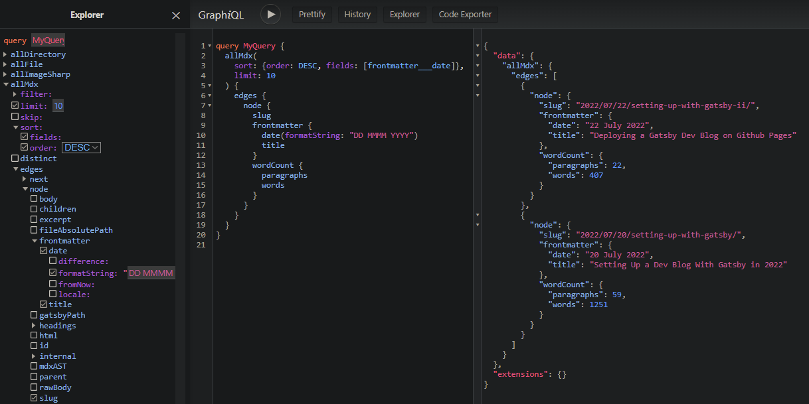

Today we will set up a new dev blog. We will build it with Gatsby.

The initial goals are just the basic functionality of an index page with links to individual posts, and some niceties for presenting a lot of code, like syntax highlighting and a copy-to-clipboard button. We will be storing our content in markdown files.

<br/>

## 1. Bootstrapping a new Gatsby Project
---

We could install `gatbsy-cli` globally or we can run it with NPX, but either way, _use the CLI to bootstrap the project_:

```sh image=init.png
npx gatsby new
```


Run the CLI and follow the prompts to choose your styling library, plugins, typescript or not, that sort of thing. This time we selected MDX support, responsive images, and React Helmet. For styling, we're going to use plain CSS modules.

The CLI will generate some files, and the first one to know about it is `gatsby-config.js/ts`:

```ts file=gatsby-config.ts
import type { GatsbyConfig } from 'gatsby'

const config: GatsbyConfig = {
  siteMetadata: {
    title: `My New Dev Blog`,
    siteUrl: `http://my.blog.local`
  },

  graphqlTypegen: true,

  plugins: [
    'gatsby-plugin-image',
    'gatsby-plugin-react-helmet',
    'gatsby-plugin-mdx',
    'gatsby-plugin-sharp',
    'gatsby-transformer-sharp',

    {
      resolve: 'gatsby-source-filesystem',
      options: {
        name: 'images',
        path: './src/images/'
      },
      __key: 'images'
    },

    {
      resolve: 'gatsby-source-filesystem',
      options: {
        name: 'pages',
        path: './src/pages/'
      },
      __key: 'pages'
    },
  ]
}

export default config
```

First, a few things for our initial setup:

### Using ES6 syntax in `gatsby-node.js`

```sh image=init.png
npm i esm
```

```js file=gatsby-node.js
require = require('esm')(module)
module.exports = require('./gatsby-node.esm.js')
```

### Add aliases for absolute imports:
```js file=gatsby-node.esm.js
const path = require('path')

export onCreateWebpackConfig = ({ actions }) => {
  actions.setWebpackConfig({
    resolve: {
      alias: {
        '@components': path.resolve(__dirname, 'src', 'components')
      }
    }
  })
}
```

```json file=ts-config.json add=3-5 exclude=1,2,6
{
  "compilerOptions": {
    "paths": {
      "@components/*": ["./src/components/*"]
    },
    ...
```

If your setup is like mine and you're using Typescript + CSS modules, you'll probably also want a definitions file along these lines to prevent the compiler from finding fault with our CSS module imports:

```ts file=src/global.d.ts.ts
declare module '*.css' {
  const content: { [className: string]: string }
  export = content
}
```

<br/>

## 2. Configuring a data source
---

Our posts (as in the mdx files) will be organized by date in subfolders. The mdx behind this post is at `./blog/2022/07/20/setting-up-with-gatsby/index.mdx` in the local filesystem, for example.

Our file system will also determine the URL of our post, so the way we organize our files is extremely important. This folder structure is what we want:

```none copy=0
📦blog
 └ 📂2022
 │ └ 📂07
 │ │ ├ 📂20
 │ │ │ └ 📂setting-up-with-gatsby
 │ │ │ │ ├ 📜index.mdx
 │ │ │ │ └ 📜mdx-graphql.png
 │ │ ├ 📂22
 │ │ │ └ 📂setting-up-with-gatsby-ii
 │ │ │ │ ├ 📜github-pages-settings.png
 │ │ │ │ └ 📜index.mdx
```

Make a folder called `blog` in the project root. This is where we will keep the markdown files that comprise our collection of blog posts.

We tell Gatsby about this `blog` folder by adding one more item at the bottom of the `plugins` array in our `gatsby-config`, just below the other `gatsby-source-filesystem` definitions.

In effect, this makes the files in the `blog` folder visible to our GraphQL queries:

```ts file=gatsby-config.ts exclude=1-3,12 add=4-11
plugins: [
  ...

  {
    resolve: 'gatsby-source-filesystem',
    options: {
      name: 'blog',
      path: './blog/'
    },
    __key: 'blog'
  }
]
```

<br/>

## 3. Create the blog index page
---

Start the development server...

```sh command=1 output=3,4
npm start

  > dev-blog@1.0.0 start
  > gatsby develop -o -p 8000
```

At [localhost:8000/___graphql](http://localhost:8000/___graphql), you get the GraphQL query interface. Basically this is just a nice UI to query Gatsby's data layer, meaning the things you have configured Gatsby to be able to get data from (like our `blog` folder). We use the UI to develop the queries we need to power our site.

For example, this query is basically what we will run to get the data to generate the index page. Try running this query while the `blog` folder is still empty:

```graphql
query BlogPosts {
  allMdx(
    sort: {order: DESC, fields: [frontmatter___date]},
    limit: 10
  ) {
    edges {
      node {
        slug
        frontmatter {
          date(formatString: "DD MMMM YYYY")
          title
        }
        wordCount {
          words
        }
      }
    }
  }
}
```

What happens is that GraphQL will throw an error: `Value "frontmatter___date" does not exist in "MdxFieldsEnum" enum`, because our query basically says `ORDER BY frontmatter___date`, which doesn't exist in the GQL schema.

If we had any files with `frontmatter___date` set, it would have been added to the schema dynamically. If not, GraphQL has no way of knowing that it exists.

However, if we really wanted our query to work in this situation and return an empty result set instead of an error, we could do something like this:

```js file=gatsby-node.esm.js
export createSchemaCustomization = ({ actions }) => {
  const { createTypes } = actions

  createTypes(`
    type Mdx implements Node {
      frontmatter: MdxFrontmatter
    }
    type MdxFrontmatter {
      date: Date @dateformat
    }
  `)
}
```

This isn't necessary because we don't plan on having an empty blog or inconsistent metadata in our MDX files. It is mentioned just to clarify how GraphQL queries are working with frontmatter in Gatsby.

In any case, we need at least [one MDX file with a date](https://raw.githubusercontent.com/jonkers3/dev-blog/master/blog/2022/07/20/setting-up-with-gatsby/index.mdx) to exist in our blog folder before we can continue. Once we have that, our query should work:



<br/>

Now, to create our index page, replace the contents of `src/pages/index.jsx` file with the following:

```jsx file=src/pages/index.jsx start=1
import * as React from 'react'
import { graphql, Link } from 'gatsby'

const Blog = ({ data }) => {
  return (
    <>
      {data.allMdx.nodes.map((node) => (
        <article key={node.id}>
          <h2>
            <Link to={`/${node.slug}`}>
              {node.frontmatter.title}
            </Link>
          </h2>
          <p>{node.frontmatter.date}</p>
          <p>{node.slug}</p>
        </article>
      ))}
    </>
  )
}

export const query = graphql`
  query {
    allMdx(sort: { fields: frontmatter___date, order: DESC }) {
      nodes {
        frontmatter {
          date(formatString: "MMMM D, YYYY")
          title
        }
        slug
        id
      }
    }
  }
`

export default Blog
```

As you have probably noticed, there is some kind of extra something going on here. It's true. Gatsby works a bit of magic, taking the results of the exported `query` and then passing it into the component as a prop called `data`.

It is a super-simple pattern where each page component has a query right alongside it, and the fact that GQL syntax resembles ES6 makes it even better, as the shape of the object we are deferencing in our component is made plainly evident just by glancing at the GQL query.

<br/>

## 4. Create a Template for Blog Posts
---

Create a blog post template:

```jsx file=src/pages/{mdx.slug}.jsx
import * as React from 'react'
import { graphql } from 'gatsby'
import { MDXRenderer } from 'gatsby-plugin-mdx'

const BlogPost = ({ data }) => {
  return (
    <>
      <p>{data.mdx.frontmatter.date}</p>
      <MDXRenderer>{data.mdx.body}</MDXRenderer>
    </>
  )
}

export const query = graphql`
  query ($id: String) {
    mdx(id: { eq: $id }) {
      frontmatter {
        title
        date(formatString: "MMMM D, YYYY")
      }
      body
    }
  }
`

export default BlogPost
```

The `{mdx.slug}` in the filename will be automatically expanded to the value returned by the query. For example: `2022/07/20/setting-up-with-gatsby/`

Now, we should be able to click the links on the index page and be brought to a page with the full content of the post.

<br/>

## 5. Create a Layout
---

The main thing we are in need of is some kind of navigation control. Eventually we need a header, footer, and that sort of thing. Getting our content nicely centered would also be nice.

We will create a shared Layout component to address these things:

```jsx file=src/components/Layout/index.jsx
import React from 'react'
import * as styles from './layout.module.css'

const Layout = ({ children }) => (
  <div className={styles.pageContainer}>
      <nav>
        <ul className={styles.navLinks}>
          <li className>
            <Link to='/'>Home</Link>
          </li>
        </ul>
      </nav>
    <div className={styles.innerContainer}>{children}</div>
  </div>
)

export default Layout
```


```css file=src/components/Layout/layout.module.css
.page-container {
  margin: 0 auto;
  padding: 0;
  box-sizing: border-box;
  max-width: 860px;
  font-family: sans-serif;
}

.inner-container {
  margin-top: 7em;
  padding: 12px;
}

.nav-links {
  column-count: 2;
  column-gap: 85%;
  display: flex;
  list-style: none;
  padding-left: 0;
}
```

Speaking of styles, let's also make a global CSS file for rules that need to apply everywhere:

```css file=src/styles/global.css
body {
  margin: 0px;
  font-family: 'Open Sans', sans-serif;
  line-height: 1.65;
  text-rendering: optimizeLegibility;
  font-size: 1.015rem;
}
```

That needs to be referenced by a gatsby-browser file, so create one:

```css file=gatsby-browser.js
import './src/styles/global.css'
```

We _could_ wrap each of our pages with our new layout component, like this:

```jsx file=src/pages/{mdx.slug}.jsx add=1,6,9 remove=5,10 start=1
import Layout from '@components/Layout'

const BlogPost = ({ data }) => {
  return (
    <>
    <Layout>
      <p>{data.mdx.frontmatter.date}</p>
      <MDXRenderer>{data.mdx.body}</MDXRenderer>
    </Layout>
    </>
  )
}
```

```jsx file=src/pages/index.jsx add=1,6,16 remove=5,17
  import Layout from '@components/Layout'

const Blog = ({ data }) => {
  return (
    <>
    <Layout>
      {data.allMdx.nodes.map((node) => (
        <article key={node.id}>
          <h2>
            <Link to={`/${node.slug}`}>{node.frontmatter.title}</Link>
          </h2>
          <p>Posted: {node.frontmatter.date}</p>
          <p>{node.slug}</p>
        </article>
      ))}
    </Layout>
    </>
  )
}
```

However, that leads to some extra unmounting and remounting during navigation. Instead of doing that, we can wrap all of our pages by default.

Add the following to `gatsby-browser.js` and export it from `gatsby-ssr.js`:

```jsx file=gatsby-browser.js add=1-2,4-9
import * as React from 'react'
import Layout from '@components/Layout'
import './src/styles/global.css'

const wrapPageElement = ({ element, props }) => {
  return <Layout {...props}>{element}</Layout>
}

export { wrapPageElement }
```

```jsx file=gatsby-ssr.js
export { wrapPageElement } from './gatsby-browser.js'
```

<br/>

## 6. Configure MDX to work with Inline Images
---

Storing image files directly alongside the markdown files is obviously ideal in our case.

We want to be able to reference images in our Markdown files like this:

```markdown
## MDX ❤️


```

We need to make a change to the configuration for the `gatsby-plugin-mdx` plugin due to the way our files are organized.

Replace the existing reference to ```'gatsby-plugin-mdx'``` with a new object definition, like this:

```ts file=gatsby-config.ts remove=1 exclude=2 add=3-12
'gatsby-plugin-mdx',

{
  resolve: `gatsby-plugin-mdx`,
  options: {
    gatsbyRemarkPlugins: [
      {
        resolve: `gatsby-remark-images`,
      }
    ]
  }
},
```

Upon restarting the development server, we can reference images as described and everything works.

As a bonus, we also now get a neat progressive loading effect, as well as responsive thumbnails.

<br/>

## 7. Color Syntax Highlighting with Prism.js
---

Our use case involves the frequent usage of code blocks, so we might as well make them as easy to digest and as visually pleasing as possible. Prism.js gives us syntax highlighting in almost any language with fairly minimal effort. To get the basic functionality we need only do three things:

### Install prism-react-renderer

```sh
npm i prism-react-renderer
```

### Create a new component to render code blocks

```jsx file=src/components/Code/index.jsx
import React from 'react'
import Highlight, { defaultProps } from 'prism-react-renderer'
import theme from 'prism-react-renderer/themes/github'

const Code = ({ codeString, language, ...props }) => {
  return (
    <Highlight
      {...defaultProps}
      code={codeString}
      language={language}
      theme={theme}
    >
      {({ className, style, tokens, getLineProps, getTokenProps }) => (
        <pre
          className={className}
          style={{ ...style, padding: '20px', position: 'relative' }}
        >

          {tokens.map((line, i) => (
            <div key={i} {...getLineProps({ line, key: i })}>
              {line.map((token, key) => (
                <span key={key} {...getTokenProps({ token, key })} />
              ))}
            </div>
          ))}
        </pre>
      )}
    </Highlight>
  )
}

export default Code
```

### Wrap MDXRenderer with provider

```jsx file=src/pages/{mdx.slug}.jsx
import * as React from 'react'
import { graphql } from 'gatsby'
import { MDXRenderer } from 'gatsby-plugin-mdx'
import { MDXProvider } from '@mdx-js/react'
import { preToCodeBlock } from 'mdx-utils'
import Code from '@components/Code'
import Layout from '@components/Layout'

const BlogPost = ({ data }) => {
  return (
    <Layout>
      <MDXProvider components={components}>
        <p>{data.mdx.frontmatter.date}</p>
        <MDXRenderer>{data.mdx.body}</MDXRenderer>
      </MDXProvider>
    </Layout>
  )
}

export const query = graphql`
  query ($id: String) {
    mdx(id: { eq: $id }) {
      frontmatter {
        title
        date(formatString: "MMMM D, YYYY")
      }
      body
    }
  }
`

const components = {
  pre: preProps => {
    if (preProps.children?.props?.mdxType !== 'code') {
      return <pre {...preProps} />
    }

    const {
      children: codeString,
      className = '',
      ...props
    } = preProps.children.props

    const match = className.match(/language-([\0-\uFFFF]*)/)

    return (
      <Code
        {...props}
        codeString={codeString.trim()}
        className={className}
        language={match != null ? match[1] : ''}
      />
    )
  }
}

export default BlogPost
```

That's basically it. This looks pretty nice once it is working, but since presenting code is a fundamental part of a dev blog, we're going to want to improve some things. Line numbers, for example, are something we will want to add.

Given the endless possibilities we will have to have a post entirely dedicated to prism.js and advanced options for it. For now, we'll just be happy about how nice and colorful things already are.

<br/>

## 8. Copy to Clipboard Button
---

If you've made it to this point, you should have a pretty spiffy looking setup coming together. As far as our initial list of desired features, the only thing we have yet to do is the Copy-to-Clipboard button. This is the last task of our initial setup. We need to change only one file to get this working. Add the following code to it:

```jsx file=src/components/Code/index.jsx add=4-7,24-32 start=1
import React from 'react'
import Highlight, { defaultProps } from 'prism-react-renderer'
import theme from 'prism-react-renderer/themes/github'
import * as styles from './code.module.css'

const CopyButton = props =>
  <button className={styles.button} {...props} />

const Code = ({ codeString, language, ...props }) => {
  const [isCopied, setIsCopied] = React.useState(false)

  return (
    <Highlight
      {...defaultProps}
      code={codeString}
      language={language}
      theme={theme}
    >
      {({ className, style, tokens, getLineProps, getTokenProps }) => (
        <pre
          className={className}
          style={{ ...style, padding: '20px', position: 'relative' }}
        >
          <CopyButton
            onClick={() => {
              navigator.clipboard.writeText(codeString)
              setIsCopied(true)
              setTimeout(() => setIsCopied(false), 4000)
            }}
          >
            {isCopied ? <i>Copied!</i> : 'Copy'}
          </CopyButton>

          {tokens.map((line, i) => (
            <div key={i} {...getLineProps({ line, key: i })}>
              {line.map((token, key) => (
                <span key={key} {...getTokenProps({ token, key })} />
              ))}
            </div>
          ))}
        </pre>
      )}
    </Highlight>
  )
}

export default Code
```

```css file=src/components/Code/code.module.css
.button {
  position: absolute;
  top: 0;
  right: 0;
  margin: 8px;
  padding: 8px 12px 8px 12px;
  border-radius: 8px;
  border-width: 0;
  background: deepskyblue;
}

```

<br/>

## 9. Wrapup
---

We now drop markdown and image files into our blog folder and know that when our app gets built and deployed, our files will be processed into blazing fast pre-built static pages, looking good and ready to be served.

Markdown and React go _good_ together. Gatsby's data layer is a perfect use case for GraphQL. These things are really meant for each other, and it is not surprising that this stack is a popular way to build websites.

For the [second part of this post](/2022/07/22/setting-up-with-gatsby-ii), we will concern ourselves with getting our new Gatsby blog deployed.
