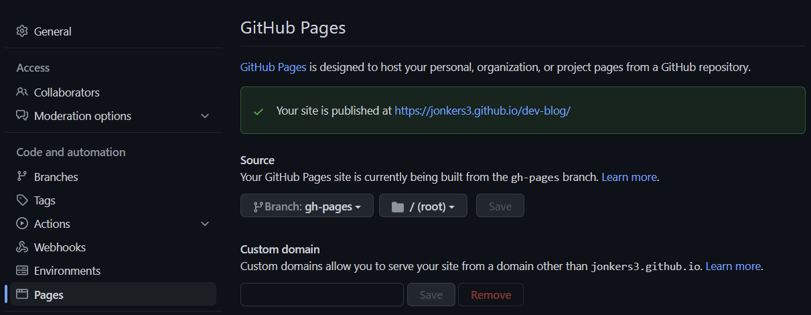

# Deploying Our New Gatsby Dev Blog

Today we will deploying the new Gatsby-based dev blog that we worked through setting up [here](/2022/07/20/setting-up-with-gatsby/).

Today, we will just deploy to Github Pages, mostly just because it is free and probably easy to set up.

Our main goal at the moment is just to get something up that we can easily add content and deploy changes to.

<br/>

## 1. Setup Github Repo and SSH
---

Create yourself a new, empty repository on [Github](https://github.com/new). Locally, the Gatsby CLI should already have initialized a git repository for us. If not, `git init`.

### Create an SSH key (with your own email)

```sh
ssh-keygen -t ed25519 -C 'your@own-email.com'

eval "$(ssh-agent -s)"

ssh-add ~/.ssh/id_ed25519
```


Copy the output of `cat ~/.ssh/id_ed25519.pub` to the clipboard, paste it [here](https://github.com/settings/ssh/new) and save it, then verify things are working by running:
```sh
ssh -T git@github.com
```

### Add a remote and push our code to Github.
```sh
git remote add origin git@github.com:jonkers3/dev-blog.git

git push --set-upstream origin master
```

At this point we should have our code live on Github in our _master_ branch.

Now, we can just commit our changes and `git push`, and our code with go straight to the master branch on Github.

<br/>

## 2. Configure Github Pages
---

On the settings page for your Github repository, make sure that branch is set to `gh-pages` and that selected folder is `root`, like this:



Gatsby is not the default for Github Pages, but it can still work, and [Github Pages Action](https://github.com/marketplace/actions/github-pages-action) looks like just the sort of thing that might make this easy. The only thing we need to do to leverage it is create the following yml file, which is a slightly modified version of the Gatsby example provided in their docs:

#### `.github/workflows/gh-pages.yml`
```yml
name: GitHub Pages

on:
  push:
    branches:
      - master
  pull_request:

jobs:
  deploy:
    runs-on: ubuntu-20.04
    permissions:
      contents: write
    concurrency:
      group: ${{ github.workflow }}-${{ github.ref }}
    steps:
      - uses: actions/checkout@v3

      - name: Setup Node
        uses: actions/setup-node@v3
        with:
          node-version: '18'

      - name: Cache dependencies
        uses: actions/cache@v2
        with:
          path: ~/.npm
          key: ${{ runner.os }}-node-${{ hashFiles('**/package-lock.json') }}
          restore-keys: |
            ${{ runner.os }}-node-

      - run: npm ci
      - run: npm run build

      - name: Deploy
        uses: peaceiris/actions-gh-pages@v3
        if: ${{ github.ref == 'refs/heads/master' }}
        with:
          github_token: ${{ secrets.GITHUB_TOKEN }}
          publish_dir: ./public
```

Once those things are setup correctly, that should be it. When the master branch is updated on Github (as in when you call `git push`), it will trigger the workflow, and the process will culminate in a new version of our site being deployed to Github Pages.

<br/>

## 3. Update gatsby-config with path prefix
---

Due to the nature of our Github Pages setup which entails our site root located in a subfolder, we need to make the one more change to ensure that all of our images and links are working right in the pages Gatsby generates. The value for our pathPrefix is, of course, the name of the Github repository. Add the pathPrefix to your config:

#### *`gatsby-config.ts`*
```javascript
  pathPrefix: 'dev-blog',
```

<br/>

## 4. Commit changes and push to Github
---

Push the rest of your changes and things should be good to go.

```sh
git commit -a -u -m 'initial deploy' && git push
```

At this point, the blog should be looking good on Github Pages. Top be honest, I was expecting it to take a little more time and effort