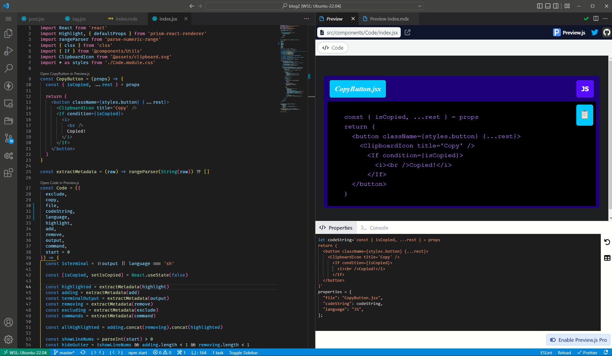

---

title: Instant feedback with preview.js

series: Slick VS Code Extensions

tags: ['VS Code']

---

This is basically Storybook with instant feedback. The preview literally updates while you type. That's how much faster ESBuild is than webpack.

Personally I really love the idea of Storybook but it's slower than I need it to be to really love it. This on the other hand, is _actually_ fast. Instant. It is exactly what I want. This has less features than Storybook but goes for a blazing fast implementation of the _essential_ feature of Storybook.

It also is supports Storybook files if you do use that. I haven't tried it myself but I'm sure you can load the .storybook files into it. There's even a CLI.

The new generation of build tools is pretty cool, and this is a pretty great way to take advantage of that for VS Code users.

